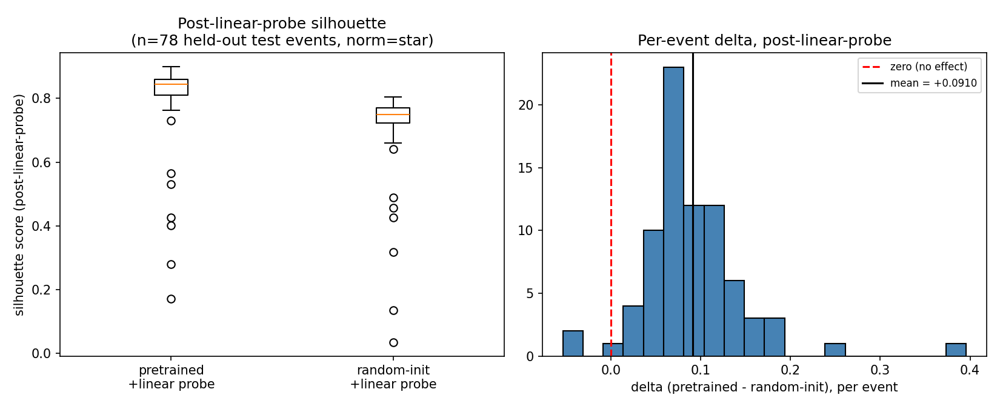
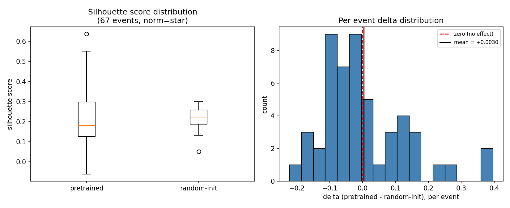
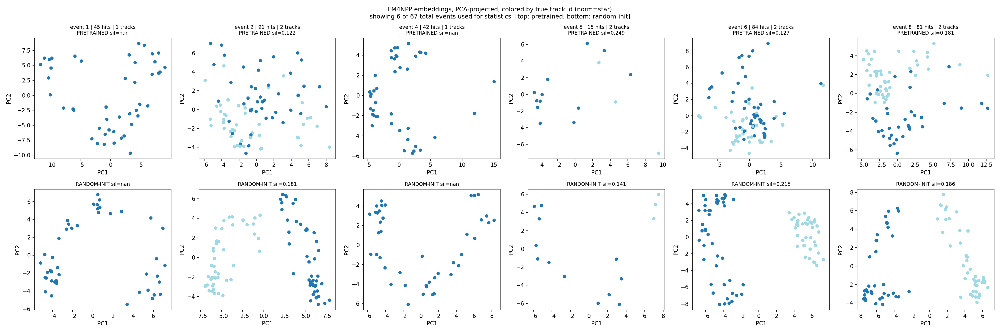

# STAR TPC × FM4NPP: Cross-Detector Transfer Probe

This repo applies [FM4NPP](https://github.com/FM4NPP/PP_collision) — a Mamba-based
foundation model pretrained on 11M simulated **sPHENIX** TPC p+p collision events
— to **STAR** TPC simulation data, to test whether the pretrained representations
carry any detectable, transferable physics structure across detectors.

FM4NPP was never trained on STAR data or STAR geometry. This is a cross-detector
transfer-learning experiment, not a "just run the pretrained model" exercise.

## Status: statistically significant evidence of transfer, with caveats

**TL;DR:** under a corrected methodology (real Hierarchical-Raster-Scan point
ordering + a trained linear probe on top of frozen embeddings, rather than raw
embeddings under approximate r-sorted ordering), a **pretrained** FM4NPP backbone
gives significantly better STAR hit-to-track separation than a **randomly
initialized** model of the same architecture: mean silhouette **0.807 ± 0.129**
(pretrained) vs **0.716 ± 0.130** (random-init) on held-out STAR test events
(n=78, mean delta **+0.091 ± 0.059**, Wilcoxon p < 0.0001) — a result now
checked for seed robustness across 5 independent random-init seeds (all
positive and significant, mean delta +0.093, seed-to-seed std ~0.010; see
[Results](#results)). This is real, statistically significant evidence that
the pretrained weights carry transferable structure — but not proof that STAR
would match the paper's own reported numbers, and two assumptions remain
open. See [Results](#results) for the full picture, including an **earlier,
less rigorous probe that found no effect** and why that methodology was
misleading, and [Known limitations](#known-limitations) /
[Next steps](#next-steps) for what's still unverified.

## Quick test

Three commands to check the pipeline actually works on your machine, once
[Environment setup](#environment-setup) is done.

**Test 1 — convert STAR data → FM4NPP format.** Uses the small real-data
fixture committed at `tests/fixtures/test_100events.root` (100 events,
~170 KB), so this works right after cloning — no download needed:

```bash
python convert_star_to_fm4npp.py \
    --input tests/fixtures/test_100events.root \
    --tree T \
    --output-dir /data/test_conversion_check \
    --max-events 100 \
    --overwrite
```

Expect output ending in `Kept 99 events` (one fixture event genuinely has 0
hits, same as in the full source file) and `[DONE] Conversion complete.`
Swap `/data/test_conversion_check` for any writable directory.

**Test 2 — frozen-backbone embedding probe (earlier, superseded methodology).**
Raw embeddings under approximate r-sorted ordering — kept runnable for history,
see [Results](#results) for why this specific probe design isn't the one to
trust. Needs the pretrained checkpoint and a full converted STAR dataset of
your own — see
[Getting the checkpoint and input data](#getting-the-checkpoint-and-input-data)
and [Usage](#usage) below to produce `data/star_fm4npp_2k/`:

```bash
python extract_embeddings_pca.py \
    --data-dir data/star_fm4npp_2k \
    --checkpoint checkpoints/pp_nerf_m3_k30.ckpt \
    --split train \
    --n-events 100 \
    --min-hits 15 \
    --norm star \
    --compare-random \
    --out embeddings_pca.png \
    --summary-out silhouette_summary.png
```

Expect a `[RESULT] event ...: silhouette=...` line per event, then a
`=== SUMMARY ===` block with mean silhouette scores and a Wilcoxon/t-test
p-value (should roughly match the earlier-methodology numbers in
[Results](#results) below), plus two PNGs written to the current directory.

**Test 3 — real point ordering + linear probe (current methodology).** The
result actually worth trusting — see [Results](#results). Also needs the
checkpoint and a converted STAR dataset:

```bash
python extract_embeddings_linear_probe.py \
    --data-dir data/star_fm4npp_2k \
    --checkpoint checkpoints/pp_nerf_m3_k30.ckpt \
    --n-fit-events 60 --n-train-events 300 --n-test-events 100 \
    --norm star --probe-epochs 30 \
    --out linear_probe_summary.png
```

Expect per-epoch `[probe] epoch ...: mean triplet loss = ...` lines during
training (for both the pretrained and random-init models), then a
`=== SUMMARY (post-linear-probe silhouette, held-out test events) ===` block
with mean silhouette scores and a Wilcoxon p-value (should roughly match
[Results](#results) below), plus `linear_probe_summary.png`.

## Repository contents

```
.
├── convert_star_to_fm4npp.py   # STAR ROOT TTree -> FM4NPP RaggedMmap format
├── extract_embeddings_pca.py   # earlier probe: raw frozen embeddings, r-sorted order (superseded)
├── star_voxelizer.py           # STAR-adapted Hierarchical Raster Scan point ordering (real Voxelizer)
├── extract_embeddings_linear_probe.py  # current probe: real point order + trained linear probe
├── extract_test_fixture.py     # regenerates tests/fixtures/test_100events.root from the real source file
├── test_convertion.py          # sanity checks on converted data
├── tests/
│   └── fixtures/
│       └── test_100events.root # committed: real 100-event subset, for fast offline pipeline testing
├── checkpoints/
│   └── pp_nerf_m3_k30.ckpt     # pretrained FM4NPP checkpoint (NOT committed to git — see below)
└── data/
    ├── merged_TPCHitsTree.root # source STAR TPC simulation (NOT committed — see below)
    └── star_fm4npp_2k/         # converted RaggedMmap output (NOT committed — see below)
```

**Do not commit `checkpoints/` or `data/` to git.** The checkpoint is tens of MB and
the ROOT/RaggedMmap files can be much larger; none of it belongs in version control.
This repo's `.gitignore`:

```gitignore
checkpoints/
data/
*.root
!tests/fixtures/*.root
*.ckpt
__pycache__/
*.pyc
```

The one deliberate exception is `tests/fixtures/*.root`: a small (~170 KB), real
100-event subset of `data/merged_TPCHitsTree.root` (not synthetic — a straight,
unmodified extraction of the tree's first 100 entries, every branch, same values
and jagged structure as the source), committed to git so the conversion pipeline
can be tested and exercised without the full ~12GB source file. See
[Test fixture](#test-fixture) below.

Document where to *get* the checkpoint and full input data instead (see below), so
the repo is reproducible without bloating it.

## Background

[FM4NPP](https://github.com/FM4NPP/PP_collision) is a Mamba/Mamba2 state-space
foundation model, self-supervised pretrained on the TPCpp-10M dataset (sPHENIX TPC
p+p collisions). This repo asks: does anything learned from sPHENIX geometry
transfer to STAR, a physically different TPC (larger radius, different pad/sector
layout, different readout)?

Two important repo-level caveats worth stating up front, discovered while getting
this working — the upstream FM4NPP repo's documentation (`README.md`, `SETUP.md`,
`example_usage.py`) is **inconsistent with its actual code** in several places:

- The real per-hit feature vector is 4D `(E, x, y, z)`, not the 30D vector described
  in `SETUP.md`/`example_usage.py`.
- The real pretrained checkpoint architecture is FM4NPP's own custom `Mamba2`
  (`fm4npp/models/mamba2.py`, exposed as the `MambaGPT` class), not `Mamba1GPT`, and
  not a `Mamba2GPT` class (which doesn't exist in the shipped code at all).
- `example_usage.py` does not run as-is (bad import, invalid `embed_method` value,
  wrong input tensor axis order).
- The `Voxelizer`/space-filling-curve point-ordering stat files
  (`bin_edges_v3_nbins_8_8_6.pkl`, `loss_bin_pp.pkl`, `loss_weight_pp.pkl`) referenced
  in the training config are **not included** in the public repo or the checkpoint
  Google Drive folder. The earlier embedding probe (`extract_embeddings_pca.py`)
  used plain r-sorted points instead of the real voxel-serialized order as a
  result. `star_voxelizer.py` addresses this by computing STAR-appropriate
  eta/phi/radius bins directly from data and reconstructing FM4NPP's real
  `Voxelizer`-based serialization — used by the current probe,
  `extract_embeddings_linear_probe.py` (see [Results](#results) and
  [Known limitations](#known-limitations), since two of the `Voxelizer`'s
  parameters are still unconfirmed assumptions even with this fix).

Everything in this repo was derived by reading FM4NPP's actual source
(`fm4npp/models/`, `fm4npp/datasets/`, `train/downstream/`), not by trusting its
docs — worth keeping in mind if you extend this further.

## Environment setup

This needs a real NVIDIA GPU on Linux (CUDA-compiled kernels, no CPU/Mac path).
Tested on Ubuntu 22.04.2, RTX 3070 (8GB VRAM), CUDA 12.1.

```bash
python3.10 -m venv ~/fm4npp-env
source ~/fm4npp-env/bin/activate
pip install --upgrade pip

pip install torch==2.5.1 torchvision --index-url https://download.pytorch.org/whl/cu121

# causal-conv1d: build from git tag v1.4.0 specifically.
# Neither PyPI (missing csrc/ source) nor the latest release (incompatible
# in-place API vs. what mamba-ssm 2.2.2 expects) work here.
git clone --depth 1 --branch v1.4.0 https://github.com/Dao-AILab/causal-conv1d.git
cd causal-conv1d && CAUSAL_CONV1D_FORCE_BUILD=TRUE MAX_JOBS=2 \
    pip install . --no-build-isolation --no-cache-dir --no-deps && cd ..

# mamba-ssm: build from git tag v2.2.2 specifically.
# PyPI sdist is missing csrc/ source; latest release pulls in Mamba-3/tilelang/
# cutlass-dsl deps that silently upgrade torch and break this pinned setup.
git clone --depth 1 --branch v2.2.2 https://github.com/state-spaces/mamba.git
cd mamba && MAMBA_FORCE_BUILD=TRUE MAX_JOBS=2 \
    pip install . --no-build-isolation --no-cache-dir --no-deps && cd ..

pip install triton mmap-ninja pyyaml numpy scipy tqdm scikit-learn matplotlib uproot awkward
```

**One required manual patch:** `mamba_ssm/__init__.py` unconditionally imports
`MambaLMHeadModel`, which pulls in a `transformers.generation` symbol
(`GreedySearchDecoderOnlyOutput`) that newer `transformers` releases removed. FM4NPP
never uses `MambaLMHeadModel`, so comment that one import line out in your installed
package:

```bash
MAMBA_INIT="$(python -c "import mamba_ssm.__file__ if False else None" 2>/dev/null; \
  find "$(python -c 'import sys; print(sys.prefix)')" -path '*/mamba_ssm/__init__.py')"
sed -i 's/^from mamba_ssm.models.mixer_seq_simple import MambaLMHeadModel/# &/' "$MAMBA_INIT"
```
(Find the file manually via `pip show -f mamba-ssm` if the one-liner above doesn't
resolve on your setup — the import fails before you can `import mamba_ssm` normally
to introspect its own path, so avoid any approach that requires importing it first.)

Verify everything:
```bash
python -c "import torch; print(torch.__version__, torch.cuda.is_available())"
python -c "from mamba_ssm import Mamba; print('mamba-ssm OK')"
python -c "import causal_conv1d; print('causal-conv1d OK')"
```

Clone FM4NPP itself alongside this repo and put it on your `PYTHONPATH`:
```bash
git clone https://github.com/FM4NPP/PP_collision.git
export PYTHONPATH=/path/to/PP_collision:$PYTHONPATH
```

## Getting the checkpoint and input data

- **Pretrained checkpoint**: from FM4NPP's README, the "Model Checkpoints" Google
  Drive link. This repo was built and tested against `pp_nerf_m3_k30.ckpt`
  (`embed_dim=512, num_layers=12, d_state=32, headdim=64, ngroups=1, klen=30`,
  `pe_method='nerf'`, FM4NPP's custom Mamba2 block — architecture derived directly
  from the checkpoint's own `state_dict` tensor shapes, since the filename's "m3"
  does not match the paper's own Table 1 model-size naming for that width).
- **STAR TPC simulation data**: a ROOT TTree (`merged_TPCHitsTree.root` here) with
  branches `TPCHits_x/y/z/q/adc/pad/row/sector/timebucket/IdTruth` per hit, one
  entry per event. Not included in this repo — supply your own STAR simulation
  output with this branch structure, or adapt `convert_star_to_fm4npp.py`'s
  `--x-branch`/`--y-branch`/etc. flags to your actual branch names.

## Usage

### 1. Convert STAR ROOT data to FM4NPP's RaggedMmap format

```bash
python convert_star_to_fm4npp.py \
    --input data/merged_TPCHitsTree.root \
    --tree T \
    --output-dir data/star_fm4npp_2k \
    --max-events 2000 \
    --train-frac 0.8 \
    --overwrite
```

Builds `(E, x, y, z)` per hit (`E` from `TPCHits_adc`, matching the ADC-signal
convention FM4NPP's `E` feature uses for sPHENIX) and `track_id` from
`TPCHits_IdTruth`. Writes `features_{train,test}/`, `seg_target_{train,test}/`, and
a zero-filled placeholder `reg_target_{train,test}/` (required by FM4NPP's dataset
loader but unused for anything in this repo — see the script's docstring).

Sanity-check the output with `test_convertion.py` before moving on.

### Test fixture

`tests/fixtures/test_100events.root` is a small, real 100-event subset of
`data/merged_TPCHitsTree.root` — the source file's first 100 entries, every
branch, unmodified — committed to git (see [Quick test](#quick-test) above to
run the conversion pipeline against it right away, no download needed).
Hits/event over the 99 non-empty events: min=3, max=116, mean≈52.

To regenerate the fixture from a fresh copy of the source file (e.g. after a
resimulation, or to pull a different/larger slice):

```bash
python extract_test_fixture.py \
    --input data/merged_TPCHitsTree.root \
    --tree T \
    --n-events 100 \
    --output tests/fixtures/test_100events.root \
    --overwrite
```

Verified readable both by `convert_star_to_fm4npp.py` (uproot) and by a real
`root` CLI/PyROOT install (`root -l tests/fixtures/test_100events.root`,
`T->Show(0)`). Note for anyone touching `extract_test_fixture.py`: as of
uproot 5.7.0, plain dict-assignment (`file[name] = {...}`) defaults to writing
an **RNTuple**, not a TTree — unreadable by a stock `root`/PyROOT install and
a silent behavior change from older uproot. The script uses
`file.mktree(name, data)` explicitly to get a real TTree instead.

### 2. Frozen-backbone embedding probe (earlier methodology — superseded)

```bash
python extract_embeddings_pca.py \
    --data-dir data/star_fm4npp_2k \
    --checkpoint checkpoints/pp_nerf_m3_k30.ckpt \
    --split train \
    --n-events 100 \
    --min-hits 15 \
    --norm star \
    --compare-random \
    --out embeddings_pca.png \
    --summary-out silhouette_summary.png
```

Replicates FM4NPP's real preprocessing (`(E,x,y,z) → polar (E,eta,phi,r) →
normalize → sort by r`), minus the `Voxelizer` serialization step (see
[Known Limitations](#known-limitations)). Extracts last-layer per-point embeddings
from the frozen pretrained backbone, and — with `--compare-random` — from an
identically-shaped but randomly initialized control model, on the *same* events.
Reports a per-event silhouette score (true track ID as the label) for both, plus a
paired Wilcoxon/t-test on the deltas.

`--norm star` recomputes eta/phi/r/E normalization stats from your STAR sample;
`--norm sphenix` keeps FM4NPP's original hardcoded sPHENIX constants, for a
true-zero-shot comparison.

**This probe's design turned out to be misleading (see [Results](#results)) —
kept runnable for history, not as the result to cite.** It measures raw
frozen embeddings under an approximate r-sorted ordering, and the FM4NPP paper
itself shows raw embeddings aren't expected to separate by track regardless of
domain transfer. Use the probe below instead.

### 3. Real point ordering + trained linear probe (current methodology)

```bash
python extract_embeddings_linear_probe.py \
    --data-dir data/star_fm4npp_2k \
    --checkpoint checkpoints/pp_nerf_m3_k30.ckpt \
    --n-fit-events 60 --n-train-events 300 --n-test-events 100 \
    --norm star --probe-epochs 30 \
    --out linear_probe_summary.png
```

Fixes both gaps in the probe above, found by reading the FM4NPP paper's
appendix directly against its actual code:

1. **Real point ordering.** `star_voxelizer.py` reconstructs FM4NPP's actual
   Hierarchical Raster Scan serialization (`fm4npp.datasets.voxelizer.Voxelizer`)
   using STAR-derived eta/phi/radius bins, in place of the plain r-sort
   approximation above. Eta/phi bins are quantile-binned straight from STAR data
   (the same algorithm the original `Voxelizer` uses); radius bins use a
   data-driven density-valley detector (`detect_radial_groups`) as a
   STAR-appropriate stand-in for the original's hardcoded sPHENIX layer
   thresholds — see the module docstring for the reasoning.
2. **A trained linear probe, not raw embeddings.** The FM4NPP paper (Figure 8)
   states that raw frozen embeddings show "no clear separation among particle
   tracks" even on the model's own native sPHENIX data — separation only
   appears after a single trained linear projection. This script trains that
   one linear layer with a triplet-loss metric-learning objective on frozen
   embeddings from STAR *training* events, then evaluates silhouette
   separation on held-out STAR *test* events, for both the pretrained backbone
   and a random-init control, so the comparison stays fair.

Events are split three ways with no event used in more than one role:
`--n-fit-events` (default 60) fits the Voxelizer's bins only, `--n-train-events`
(default 300) trains the linear probe, `--n-test-events` (default 100) is held
out purely for the final silhouette evaluation reported in
[Results](#results).

This is still a lighter stand-in for the paper's real downstream head (a
transformer-decoder instance-segmentation adapter trained with Hungarian
matching + Dice/Focal/classification losses) — see
[Known limitations](#known-limitations).

## Results

### Current methodology: real point ordering + trained linear probe

Run with `--norm star`, 60 fit / 300 train / 100 held-out test STAR events
(`min-hits=15`), evaluated with the linear probe from
[Usage §3](#3-real-point-ordering--trained-linear-probe-current-methodology):

| model | mean silhouette (held-out test) |
|---|---|
| pretrained + linear probe  | 0.807 ± 0.129 |
| random-init + linear probe | 0.716 ± 0.130 |

Mean delta (pretrained − random-init): **+0.091 ± 0.059** across n=78 valid
held-out test events (some of the 100 held out have too few hits or too few
distinct tracks for silhouette score to be meaningful and are excluded, same
filter as the earlier probe). Paired Wilcoxon signed-rank test on the
per-event deltas: **p < 0.0001**. See `linear_probe_summary.png` below for the
score distributions and per-event delta histogram:



**Interpretation:** this is statistically significant evidence that the
pretrained FM4NPP backbone carries hit-to-track structure that transfers to
STAR — a real, positive result, not present in the earlier raw-embedding probe
below. It is **not** evidence that STAR performance would match the paper's
own reported sPHENIX ARI/efficiency numbers, and (at the time this single run
was made) it rested on three specific caveats — see the multi-seed check right
below, which has since resolved one of them.

### Multi-seed robustness check (resolves caveat (c) below)

The single run above used one random-init seed, leaving open the question of
whether +0.091 reflects pretraining or just a favorable random draw for the
control model. Resolved by rerunning the identical methodology
(`--n-fit-events 60 --n-train-events 300 --n-test-events 100 --norm star
--probe-epochs 30`) end-to-end across 5 independent seeds (`--seed 1`
through `--seed 5`, logs in `multiseed_runs/log_seed{1..5}.txt`):

| seed | mean delta (pretrained − random-init) | Wilcoxon p |
|---|---|---|
| 1 | +0.0778 | < 0.0001 |
| 2 | +0.0992 | < 0.0001 |
| 3 | +0.1047 | < 0.0001 |
| 4 | +0.0978 | < 0.0001 |
| 5 | +0.0844 | < 0.0001 |

Mean of means: **+0.0928**, std across seeds: **~0.010**. All 5 seeds land
positive and significant, and the seed-to-seed spread (~0.010) is roughly 5×
smaller than the within-run std of any individual seed's per-event deltas
(~0.05) — the gap between pretrained and random-init is stable across
independent random draws, not an artifact of one favorable control run.

**Status: checked, confirmed robust.** This resolves caveat (c) below —
kept documented as resolved rather than silently dropped, since it was an
open question as of the single-run result above. Caveats (a) and (b) remain
open; see [Known limitations](#known-limitations).

### Earlier methodology (superseded): raw embeddings, approximate r-sorted order

*Kept here for history, not as the result to cite — this was the original
probe, before closely reading the FM4NPP paper revealed two problems with its
design (below). Reproduces with the `extract_embeddings_pca.py` command in
[Quick test](#quick-test) / [Usage §2](#2-frozen-backbone-embedding-probe-earlier-methodology--superseded).*

Run at `n=100` STAR events, `min-hits=15`, both normalization modes:

| norm mode | mean silhouette (pretrained) | mean silhouette (random-init) | mean delta |
|---|---|---|---|
| `star`    | ~0.20 | ~0.19 | +0.0074 |
| `sphenix` | ~0.19 | ~0.19 | +0.0076 |

Both normalization modes gave essentially the same near-zero delta, with the
per-event delta histogram straddling zero in both cases (roughly symmetric mass
on either side, not statistically significant):




At the time this was read as "no detectable advantage of pretrained weights."
In hindsight, two problems with the methodology explain the null result rather
than the pretrained weights actually carrying nothing:

1. It measured **raw** frozen embeddings. The FM4NPP paper's own Figure 8 shows
   raw embeddings lack clear track separation even in-distribution on native
   sPHENIX data — separation only emerges after training a single linear
   projection on top. This probe was never likely to show clustering,
   regardless of whether the pretrained weights transfer.
2. It used a **plain r-sort** approximation of point ordering instead of the
   real Hierarchical Raster Scan the model was actually trained on (the
   sPHENIX-specific bin-stat files needed to reconstruct that ordering were
   never published). Mamba is an order-sensitive sequential model, so feeding
   it a materially different point order than it was trained on can suppress
   whatever structure the embeddings otherwise carry.

The fact that both `star` and `sphenix` normalization gave the *same* null
result did correctly rule out normalization/domain-gap mismatch as the
explanation — it just pointed at the wrong remaining culprit (point ordering
alone) instead of the combination of both issues above. Both are addressed in
the current methodology above.

## Known limitations

The current (linear-probe) result above is methodologically much sounder than
the earlier raw-embedding probe, but it is still not a fully validated
result. Three specific things were flagged; one is now resolved:

- **(a) Voxelizer ordering parameters are unconfirmed assumptions.**
  `star_voxelizer.py` computes STAR-specific eta/phi/radius bins directly from
  data, fixing the missing-`.pkl`-files gap the earlier probe had. But
  `Voxelizer`'s `dim_sweep_order` and `revert_order` parameters — which also
  affect the final point order — are left at the class's own defaults
  (`[0, 1, 2]` / `[0, 1, 2]`) because the real m3/k30 training config was never
  published; there is no way to recover the true values short of asking the
  FM4NPP authors. If the current result turns out to be sensitive to this,
  it's the first parameter worth sweeping.
- **(b) The linear probe is a lighter stand-in for the paper's real adapter,
  not a reimplementation of it.** FM4NPP's actual downstream head is a
  transformer-decoder instance-segmentation adapter trained with Hungarian
  matching plus Dice/Focal/classification losses (paper Figure 4).
  `extract_embeddings_linear_probe.py` instead trains a single linear layer
  with a supervised triplet-loss metric-learning objective — sufficient to
  show that pretrained embeddings carry transferable structure (which is what
  silhouette score measures), but not sufficient to claim STAR would reproduce
  the paper's reported ARI/efficiency numbers.
- **(c) ~~Single run, single random-init seed.~~ RESOLVED — checked, confirmed
  robust.** The original concern: the random-init control was one seed of one
  randomly initialized model, so the +0.091 mean delta might reflect a
  favorable random draw rather than pretraining. Checked via a 5-seed sweep
  (see [Results → Multi-seed robustness check](#multi-seed-robustness-check-resolves-caveat-c-below)):
  all 5 seeds gave a positive, significant delta (+0.078 to +0.105, mean
  +0.093, seed-to-seed std ~0.010 — about 5× tighter than the per-event
  spread within any one run). Kept here, marked resolved, rather than removed,
  since it was an open caveat as of the original single-run result.

Two limitations carried over unchanged from the earlier methodology:

- **`reg_target` is a zero-filled placeholder.** The STAR hit tree used here has no
  per-hit truth momentum/vertex information, so the auxiliary regression target
  FM4NPP's dataset loader expects is filled with zeros. This only matters if you
  train with `return_reg=True`; nothing in this repo currently does.
- **Small/imbalanced event samples.** Some STAR events have very few hits or only
  a single track, which silhouette score can't meaningfully evaluate (reported as
  `NaN` and excluded from aggregate statistics).

## Next steps

The linear-probe result above is real, statistically significant evidence of
transfer, now checked for seed-to-seed robustness — but not yet a fully
validated result. What's actually still open, directly corresponding to the
remaining caveats in [Known limitations](#known-limitations):

- ~~Multi-seed robustness check (caveat c)~~ — **done**, see
  [Results → Multi-seed robustness check](#multi-seed-robustness-check-resolves-caveat-c-below):
  5 seeds, all positive and significant, seed-to-seed std ~0.010. No longer
  an open item; kept here, struck through, rather than deleted.

1. **Confirm or sweep the Voxelizer's `dim_sweep_order`/`revert_order` (caveat
   a).** Currently class defaults, not recovered from the real training
   config. Worth requesting from the FM4NPP authors directly, or sweeping
   empirically, to rule out that the current result depends on an
   accidentally-favorable ordering choice.
2. **Match the paper's real adapter architecture (caveat b).** Replace the
   triplet-loss linear probe with FM4NPP's actual transformer-decoder
   instance-segmentation head (Hungarian matching + Dice/Focal/classification
   losses, `train/downstream/`) to get numbers directly comparable to the
   paper's reported ARI/efficiency, rather than just a directional signal that
   transfer exists. This is the natural escalation now that the result has
   held up across seeds — it uses FM4NPP's own
   `train/downstream/track_finding_trainer.py` with
   `mambaversion: mamba2`, `pretrained_ckpt` pointing at the checkpoint above,
   and (optionally) `use_lora: true` for a lighter-weight fine-tune instead of
   a full adapter train.

## Acknowledgments

Built on top of [FM4NPP/PP_collision](https://github.com/FM4NPP/PP_collision).
See that repo for the original pretraining methodology and the TPCpp-10M dataset
paper. This repo is an independent cross-detector transfer experiment and is not
affiliated with the original FM4NPP authors.