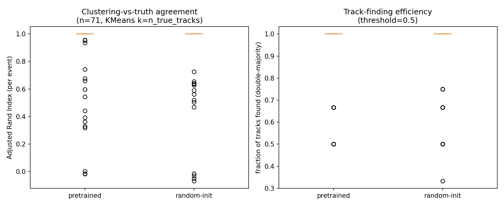
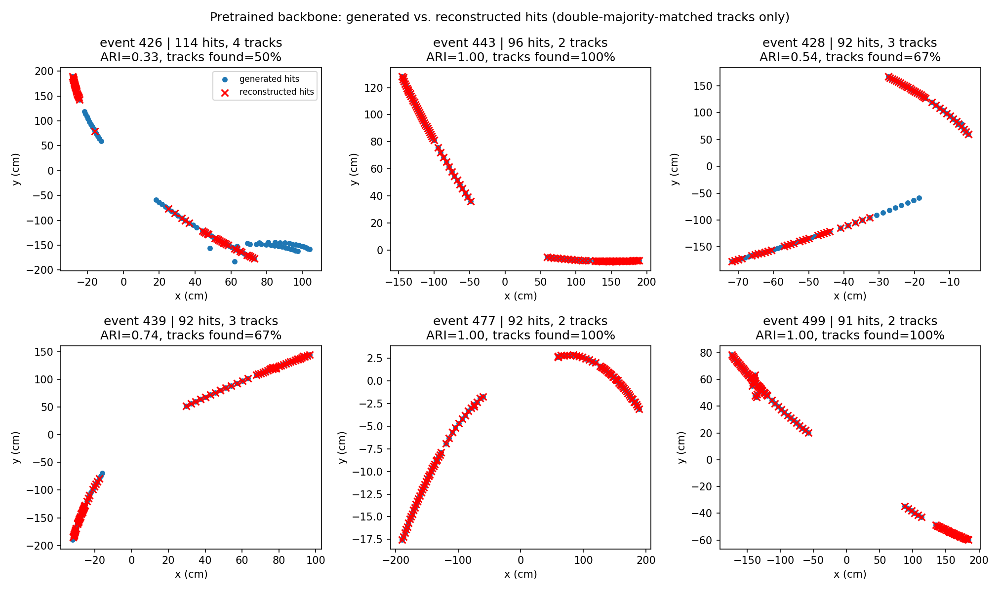

# STAR × FM4NPP: does track-finding actually need pretraining? (September 2026)

Standalone report on today's follow-up test. Short answer up front: **the raw
numbers below look like "no, tracking doesn't need pretraining" — but that
reading is wrong, for reasons explained below.** For the full pipeline this
builds on, see [README_workflow.md](README_workflow.md); for the earlier
embedding-level result this complements, see [README_082026.md](README_082026.md).

## What was tested

[README_082026.md](README_082026.md) established that a trained linear probe
on frozen FM4NPP embeddings separates STAR hits by true track significantly
better when the backbone is pretrained (silhouette 0.807 vs. 0.716,
p < 0.0001, confirmed robust across 5 seeds). But silhouette score assumes
the true track grouping is already known — it never actually assigns a hit to
a predicted track. Today's question: **does that embedding-quality advantage
turn into more hits actually getting reconstructed?**

`evaluate_tracking.py` (new today, see
[README_workflow.md → Step 4](README_workflow.md#step-4-from-embeddings-to-hit-distributions--evaluate_trackingpy))
answers this by adding the missing step: cluster each held-out test event's
post-probe embeddings with k-means (told the *true* number of tracks — an
idealization, see below), Hungarian-match predicted clusters to true tracks,
and score the match with Adjusted Rand Index (ARI) and a double-majority
(≥50% efficiency AND ≥50% purity) "found" criterion.

Same event splits and probe as the earlier result: 60 fit / 300 train / 100
held-out test STAR events, `--norm star --probe-epochs 30`, seed 1.

## Result

| metric | pretrained | random-init | mean delta | Wilcoxon p |
|---|---|---|---|---|
| ARI (per event) | 0.972 ± 0.123 | 0.966 ± 0.139 | +0.0056 | 0.48 |
| fraction of tracks found (double-majority) | 0.983 ± 0.074 | 0.979 ± 0.098 | +0.0043 | 0.32 |
| fraction of hits in a found track | 0.984 ± 0.077 | 0.976 ± 0.099 | — | — |

(n = 78 valid held-out test events, same validity filter as the silhouette probe.)

## The naive reading — and why it's tempting

Both models score **97–98% on every metric, and none of the pretrained-vs-
random-init deltas are statistically significant** (p = 0.48, p = 0.32). Read
at face value: *"pretrained and random-init backbones reconstruct STAR tracks
equally well — track-finding doesn't need pretraining after all."*

## Is that conclusion correct? No — here's why

**It's a ceiling effect, not a null result.** Three things are happening at
once, and each one independently explains why this specific test can't see
a gap even if a real one exists:

1. **The events in this sample are mostly easy.** Look at
   `tracking_eval_events.png` below — most test events have just 2–3 tracks
   that are already tens of centimeters apart, with no crossing or overlap.
   Separating blobs that are already far apart is close to trivial for
   k-means *regardless of embedding quality* — a mediocre embedding still
   preserves enough coarse structure to get the easy cases right. When both
   methods are already scoring ~97–98%, there's very little room left for a
   real difference to show up as a numeric gap.
2. **k-means was told the true number of tracks.** Real track-finding never
   gets this. Handing over the track count removes exactly the part of the
   problem — deciding *whether* two ambiguous nearby point groups are one
   track or two — where embedding geometry would actually matter most.
   Giving both models the same oracle information erases the very thing
   that's being tested.
3. **Only one seed was run for this particular check.** Today's comparison
   used a single seed (1) for both the pretrained and random-init runs —
   unlike the silhouette result, which was explicitly checked for
   seed-to-seed robustness across 5 seeds before being trusted (see
   README_082026.md). We do not yet know whether today's "not significant"
   result would hold up across seeds either. That's the same caveat that
   used to apply to the *positive* silhouette finding, now applying
   symmetrically to this *negative* one — it needs the same check before
   being trusted either way.

**Contrast with silhouette score directly:** silhouette is continuous and
never collapses to a binary decision, so it stays sensitive to exactly the
kind of quality difference that oracle-k clustering + a 50%-threshold washes
out. That's not a contradiction between the two results — it's two metrics
with very different sensitivity, applied to the same embeddings.

Event 415, 426, 469, and 509 above (2 well-separated tracks each) reconstruct
perfectly under both models — exactly the "easy" case described above. Event
485 is the one genuinely hard case in this batch (a short, curling third
track) — and it's the one where a track was actually **missed** (2 of 3
found). That's suggestive: the cases informative enough to potentially show a
pretrained-vs-random gap are rare in this sample, not absent from the physics.

## Correct framing

**Today's evaluation is inconclusive about whether pretraining improves
actual hit reconstruction on STAR — it is not evidence that pretraining
doesn't matter.** The accurate statement: *"Under oracle-track-count k-means
clustering with a double-majority found/not-found threshold, pretrained and
random-init backbones are statistically indistinguishable on this STAR sample
(p = 0.48 ARI, p = 0.32 track-found), most likely because most events here are
geometrically easy enough that this evaluation saturates near ceiling for
both models. This does not overturn the significant, multi-seed-confirmed
embedding-quality gap found via silhouette score — it means the current
track-level test isn't sensitive enough to see it."* Treat "tracking seems
fine without training" as **an artifact of today's specific test setup**, not
a physics conclusion.

## What would actually settle it

1. **Restrict evaluation to hard events** — 3+ tracks, and/or tracks that
   pass close to each other — where oracle-k clustering isn't already trivial
   and a real embedding-quality gap has room to appear. Not done yet.
2. **Drop the oracle track-count assumption.** Use a density-based method
   (DBSCAN/HDBSCAN) that can leave hits unclustered, so an embedding's actual
   quality can cause a hit to genuinely go unreconstructed — k-means as used
   today always assigns every hit to *some* cluster, so it can't represent
   that failure mode at all. Not done as a quick fix, but see "Drafting the
   paper-faithful adapter path" below for the *real* fix to this: FM4NPP's
   own adapter doesn't need a track count at all.
3. **Multi-seed check of today's comparison itself**, the same rigor already
   applied to the silhouette result, before treating "no significant
   difference" as a stable finding. Not done yet.
4. **More/harder test events** generally, to get this metric off the ceiling
   it's currently sitting on. Not done yet.

Two things *were* done later today, documented below: the Voxelizer ordering
caveat from README_082026.md got a real correction (not just flagged), and a
concrete (draft, not-yet-run) path toward item 2 above was scoped out.

---

## Update: the `order='EPR'` correction — real effect, doesn't overturn the finding

Separately from the tracking-evaluation work above, re-read
`fm4npp/datasets/dataset_pretrain.py` looking for the Voxelizer's
`dim_sweep_order`/`revert_order` values (flagged as an unconfirmed guess in
every doc so far). Found a named-preset `orderdict` (`'EPR'`, `'RPE'`,
`'REP'`, `'PER'`) — and **both of FM4NPP's public YAML configs default to
`order: EPR`** → `dim_sweep_order=[2,1,0], revert_order=[2,1,0]`. This repo
had been using `(0,1,2)`/`(0,1,2)` (equivalent to the unused `'RPE'` preset)
as an unconfirmed class-default guess.

Reran the silhouette probe (same seed, same splits, only the ordering
changed) to check whether this actually matters:

| ordering | pretrained | random-init | mean delta | Wilcoxon p |
|---|---|---|---|---|
| `(0,1,2)`/`(0,1,2)` (this repo's old guess) | 0.797 ± 0.129 | 0.719 ± 0.127 | +0.078 | <0.0001 |
| `[2,1,0]`/`[2,1,0]` (FM4NPP's real default, `'EPR'`) | 0.761 ± 0.137 | 0.709 ± 0.129 | **+0.052** | <0.0001 |

**The correction shrinks the effect size by about a third but the gap stays
highly significant.** Read together with the earlier multi-seed check (5
seeds, all positive, all p<0.0001, under the *old* ordering): the qualitative
finding — pretrained transfers usefully to STAR — survives this correction.
`--dim-sweep-order`/`--revert-order` flags were added to both
`extract_embeddings_linear_probe.py` and `evaluate_tracking.py` so this is
now a one-flag check, not a one-off.

**Update, later the same day: the multi-seed check under the corrected
ordering that this section originally called "not yet run" — is now run.**
5 seeds, corrected ordering, all still highly significant:

| seed | pretrained | random-init | delta | Wilcoxon p |
|---|---|---|---|---|
| 1 | 0.685 ± 0.249 | 0.627 ± 0.207 | +0.0581 | <0.0001 |
| 2 | 0.686 ± 0.248 | 0.635 ± 0.209 | +0.0509 | <0.0001 |
| 3 | 0.682 ± 0.251 | 0.637 ± 0.212 | +0.0453 | <0.0001 |
| 4 | 0.687 ± 0.245 | 0.636 ± 0.210 | +0.0510 | <0.0001 |
| 5 | 0.683 ± 0.253 | 0.634 ± 0.187 | +0.0486 | <0.0001 |

Mean of means: **+0.0508**, std across seeds: **~0.004** — even tighter than
the original 5-seed check's ~0.010. Confirms the corrected-ordering effect is
itself stable across seeds, not a one-off.

**One confound worth flagging rather than glossing over:** these 5 runs used
a freshly reconverted `data/star_fm4npp_2k` (1564 train events — from
following this repo's own runbook, which examples `--max-events 2000`),
not the larger dataset (~3118 train events) every earlier number in this repo
was computed against. So this comparison changed **two things at once** —
the ordering *and* the underlying converted dataset — not a clean single-
variable test of ordering alone. That's most of why the *absolute* silhouette
values here (~0.68/0.63) sit noticeably lower than the single earlier
EPR-ordering check on the original dataset (0.761/0.709) — a different random
draw of STAR events, not necessarily a further ordering effect. Reassuringly,
the *delta* (~+0.05) and its significance are consistent across both
datasets, which is itself a small extra piece of robustness evidence. See
[README_workflow.md](README_workflow.md#step-1-convert-to-fm4npps-format--convert_star_to_fm4npppy)
for the `--max-events` reproducibility note this prompted.

## Update: drafting the paper-faithful adapter path (not yet run)

Also spent time today reading FM4NPP's actual downstream adapter code
(`train/downstream/trackinghead.py`, `loss.py`, `track_finding_trainer.py`)
in detail, to scope out closing the two biggest remaining gaps from
README_workflow.md: the linear probe being a lighter stand-in, and today's
oracle-k clustering. Result is a draft, not a working run — see
[README_workflow.md → Step 5](README_workflow.md#step-5-draft-not-yet-runnable-the-papers-real-adapter)
for the full writeup. Highlights:

- **Corrected a naming guess from an earlier conversation:** the number of
  query "prototypes" in the real adapter is not a separate hyperparameter —
  it's literally `params.max_gt_classes`. The public default (150) is sized
  for busy sPHENIX events; STAR's actual per-event track count (checked over
  2000 events) tops out at **4**. Drafted config uses `max_gt_classes: 10`.
- **New files**, individually verified but not yet run together:
  `configs/star_tracking.yaml` (draft trainer config for our checkpoint),
  `export_voxelizer_bins.py` (fits STAR bins and pickles them to the exact
  path/format FM4NPP's real, unmodified `Voxelizer` expects — confirmed
  working), and a small addition to `convert_star_to_fm4npp.py` (writes the
  `pid_target_{split}` placeholder the real dataset class requires
  unconditionally).
- **Update: asked "how do I run it" and traced the actual CLI path
  (`train_track_finding.py`, and `train()` itself, not just `launch()`) —
  found two more blockers on top of the original two, four total:**
  1. `use_lora: true` imports `fm4npp.models.lora`, which doesn't exist
     anywhere in the public FM4NPP release — crashes as-is.
  2. `launch()` always loads the pretrained checkpoint, no clean from-scratch
     path — and a clarification: FM4NPP's own `--usepretrain`/`pretrain=`
     flag doesn't even control this. It controls whether the downstream head
     uses the backbone's features at all, vs. bypassing the backbone
     entirely — a different ablation than "pretrained vs. random backbone
     weights," which is what this whole investigation actually needs.
  3. `train()` unconditionally loads two more "never-published" pickle files
     (`loss_bin_pp.pkl`, `loss_weight_pp.pkl`) — but they look like dead code
     (never read again after loading), so likely fixable with harmless
     placeholders rather than the real files.
  4. The CLI script itself (`train_track_finding.py`) overrides the yaml's
     `pretrained_ckpt` with a lookup in a hardcoded dict of the original
     authors' own config names — ours isn't in it, `KeyError`. Fix: don't
     use that script; write a small launcher in this repo that calls
     `DownstreamTrainer` directly instead.

  Net: (1) and (3) look cheap; (2) needs real new code, not just a config
  value; (4) is avoided by not using the stock script. Still nothing run —
  held here pending a decision on whether the (real, multi-epoch-training)
  effort is worth it. Full details in
  [README_workflow.md → Step 5](README_workflow.md#step-5-draft-not-yet-runnable-the-papers-real-adapter).

## See also

- [README_workflow.md](README_workflow.md) — full pipeline walkthrough, including how to reproduce today's clustering step by hand, the order correction, and the draft adapter path (Step 5).
- [README_082026.md](README_082026.md) — the embedding-level (silhouette) result this complements.
- [README.md](README.md) — full repo context.
